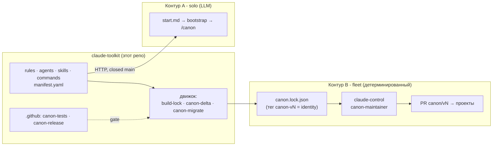

# claude-toolkit

Персональный канон правил, агентов и скиллов для [Claude Code](https://claude.com/claude-code) - плюс детерминированный, транзакционный движок, который упаковывает его в immutable-релизы и раскатывает по проектам без потери локальных правок.

> Половина системы из двух репозиториев. Второй - [**claude-control**](https://github.com/dewil/claude-control): автономная инфраструктура поверх Claude Code, чей fleet-reconciler потребляет движок этого репо, чтобы раскатывать канон по парку проектов через pull request'ы. Здесь - источник канона и движок его доставки; там - оператор, который это исполняет.

> [!IMPORTANT]
> **Этот канон сильно персонализирован под меня** - мои правила, агенты, конвенции, привычки. Это не универсальный дистрибутив. Хочешь такой же инструмент - **сделай свою копию и пройди первичную настройку под себя** (см. [Свой персональный toolkit](#свой-персональный-toolkit)), а не подключай проекты к моему канону: приедут мои решения, и они могут тебе не подойти. Ценность здесь - в **механике** (движок, модель релизов, дисциплина верификации), а не в конкретных правилах.

## Зачем

Claude Code из коробки - чистый помощник без памяти о твоих привычках. Чтобы он вёл себя предсказуемо, на каждый проект приходится заново писать правила, объяснять конвенции, описывать субагентов, настраивать память - полдня на проект. А правило, отлаженное в одном месте, не доезжает до остальных: опыт не копится.

`claude-toolkit` держит канон в одном месте и раскатывает его двумя контурами - в зависимости от того, solo это или автоматический парк.



- **Контур A - solo, LLM-оркестрация.** Новый проект бутстрапается одной фразой: Claude фетчит канон по HTTP, раскладывает по `.claude/`, спрашивает тип проекта и докладывает специализацию. Синк (`/canon`) сравнивает трёхсторонне и по каждому файлу спрашивает "обновить?". Никаких симлинков, только явные снимки и явное "ок".
- **Контур B - fleet, детерминированный движок.** Канон собирается в immutable release-дескриптор (`canon.lock.json`, identity = git commit_sha аннотированного тега), и [claude-control](https://github.com/dewil/claude-control) раскатывает его по парку через PR-ы дельта-движком с транзакционным WAL - **без LLM в data-plane**. См. [Детерминированный движок](#детерминированный-движок).

## Что это даёт

- **Быстрый старт.** Новый проект готов за минуты - сразу с типографикой, агентами и правилами под свой тип, без копипасты снипетов.
- **Накопление опыта.** Найденное в одном проекте правило переезжает в канон и через синк доходит до остальных. Эффект растёт с числом проектов.
- **Согласованность.** Claude ведёт себя одинаково во всех проектах - одни конвенции, одни агенты.
- **Специализация под тип.** Кодовый проект получает правила тестов и обработки ошибок, документационный - copy-editor. Лишнее не тянется.
- **Под контролем.** Канон - явные снимки по HTTP с закоммиченного `main`. Правка - только после "ок". На свежем проекте синк отрабатывает как no-op (для fleet-движка это буквально 0 вызовов LLM).

## Для каких проектов

Не только про код. Bootstrap спросит тип и докинет специализацию поверх универсального набора:

- **coding** - кодовые проекты любого стека: правила тестов и обработки ошибок, агенты `debugger`, `implementer`, `code-reviewer`.
- **documentation** - тексты, инструкции, базы знаний: агент `copy-editor`.
- **management** - управленческие проекты, планирование: агент `tracker`, правила встреч/задач/оценок и сверки имён, скиллы зеркалирования внешних источников (`telegram-snapshot`, `redmine-snapshot`, `mymeet-snapshot`).
- **education** - учебные материалы, конспекты: агент `note-taker`, правила конспектов/ДЗ и скилл `tutor`.
- **wiki** - Obsidian-vault'ы: правила формата заметки и перелинковки, агенты `note-writer` и `librarian` (ревизия vault'а на битые ссылки/дубли/сироты).

Проект может быть **мультиспециализированным**: vault со встроенной кодовой частью возьмёт сразу `wiki`, `coding` и `documentation` - специализации накладываются друг на друга.

## Быстрый старт - новый проект

Открой Claude Code в корне нового проекта и скажи:

```
выполни инструкции из https://raw.githubusercontent.com/dewil/claude-toolkit/main/start.md
```

Агент проведёт через настройку памяти, базовых правил, агентов и специализацию под тип.

## Обновление существующего проекта (solo)

Если проект уже бутстрапленный (в `.claude/` есть канон-реестр), открой в его корне Claude Code и запусти:

```
/canon
```

Агент прочитает реестр, скачает актуальный канон, опишет расхождения по каждому файлу и спросит, что накатить; через `manifest.yaml` проверит, не появились ли новые файлы под тип проекта. Это **контур A** (LLM). Для автоматической раскатки по парку работает **контур B** - детерминированный движок ниже.

## Детерминированный движок

Сердцевина контура B и самая плотная инженерия репо. Канон-синк перестаёт быть LLM-миссией (десятки тысяч токенов на no-op) и становится чистым дельта-скриптом над **immutable release-дескриптором**.

- **`scripts/build-lock.py`** - генератор `canon.lock.json`: blob_sha + mode каждого файла из git-дерева, membership по типам, `manifest_digest`. Плюс server-side gate (`--check`), который CI гоняет на теге `canon-vN`. Identity релиза = **git commit_sha** аннотированного тега, не содержимое: одна и та же зафиксированная ревизия раскатывается везде.
- **`scripts/canon-delta.py`** (~73 КБ) - транзакционный движок применения. UNION-классификатор (10 классов), **трёхстороннее сравнение** (база / локальная копия / канон - отличить "правил под себя" от "канон ушёл вперёд"), планировщик, и **WAL** с crash-матрицей: prepare -> commit -> clear, recovery roll-forward/back, CAS перед rename, no-clobber на чужие файлы, containment записи в пределах проекта, atomic temp+rename. Разрешение конфликтов - явным API (accept per-path / keep-local / skip), а не молчаливым сваливанием.
- **`scripts/canon-migrate.py`** - одноразовое расщепление старого монолита `canon.yaml` (sha256) на `intent` (человек: тип/трек/оверрайды) / `state.json` (машина: git-blob-sha, rollout_record, резолюции) / `ledger` (harvester upstream_pending).
- **`.github/workflows/`** - `canon-tests` (прогон движка на каждый push) + `canon-release` (build-lock + gate на теге, публикация lock как release-asset).
- **Изоляция.** Канон тянется **только по HTTP** с закоммиченного `main` (или из git-зеркала по commit_sha) - даже если клон toolkit лежит соседней папкой, проект его не ищет. Везде одна зафиксированная версия, а не чьё-то рабочее дерево.

**Как это верифицировано.** Транзакционный слой не "полируется на бумаге" - он вынесен в §10-контракт и доказывается **fault-injection тестами**: `tests/` - ~100 stdlib-тестов, включая crash-матрицу WAL и по регресс-тесту на **каждую** находку состязательного (adversarial) ревью. Движок прошёл несколько раундов adversarial-верификации второй моделью до GO; путь-маппинг проекта (канон под `.claude/`, `scripts/` в корне) отдельно закрыл 4 раунда находок (path traversal, алиас-коллизии на case-insensitive ФС, потеря правок на legacy-раскладке) - каждая с фиксом и тестом.

## Обратный поток - upstream

Полезное, родившееся в конкретном проекте, выносится обратно в канон: синк собирает самодостаточный бриф (`toolkit-log/upstream-pending/`), его можно скормить Claude в клоне toolkit, отревьюить и закоммитить. Проект ничего не знает, где на машине лежит клон - связь строго односторонняя, через явные артефакты. На следующем синке проект видит, что правило доехало, и чистит пометку. В fleet-контуре harvester [claude-control](https://github.com/dewil/claude-control) автоматизирует сбор таких кандидатов.

## Принципы

- **Идемпотентность** - любой промт и любой проход движка безопасны при повторе.
- **Audit -> plan -> "ок" -> action** - изменения только после явного подтверждения (в solo) или через PR с ревью человеком (в fleet).
- **Изоляция** - проект не знает про filesystem-расположение клона toolkit; канон только по HTTP/commit_sha.
- **Канон в одном экземпляре** - правила и агенты живут только здесь, не дублируются heredoc'ом.
- **Детерминизм** - в data-plane никакого LLM; он поднимается только on-demand на разрешение конфликтов.

## Структура

- `start.md` - точка входа (тонкий роутер, контур A).
- `bootstrap/` - цепочка настройки проекта с нуля (`bootstrap-01/02/03`).
- `rules/` - канонические правила поведения Claude (22).
- `agents/` - канонические описания субагентов (13).
- `skills/` - канонические скиллы, папка на скилл (15).
- `commands/` - канонические слэш-команды (`/canon` = sync).
- `scripts/` - **две вещи разной природы**: (1) движок канон-синка `build-lock.py` / `canon-delta.py` / `canon-migrate.py` (не распространяется в проекты - это оснастка); (2) канонические скрипты для проектов (`md-pdf.py`, `session-cost.py`, зеркалирование `telegram-*`/`redmine-*`/`mymeet-*`).
- `tests/` - stdlib-тесты движка (~100, crash-матрица + регресс на каждую adversarial-находку).
- `.github/workflows/` - CI: `canon-tests`, `canon-release`.
- `templates/` - скелеты с TODO-заглушками, копируются в проект один раз; дальше проект владеет ими сам.
- `migrations/` - одноразовые промты апгрейда (в т.ч. `sync-from-canon`).
- `manifest.yaml` - полный список канон-файлов по типам, с однострочным описанием. Единственный реестр: bootstrap и sync тянут списки отсюда.
- `CLAUDE.md` - агентский контекст для Claude, работающего внутри этого репо (правка канона); импортирует этот README.

## Свой персональный toolkit

Репо рассчитан на форк под себя - свои правила, свою типографику (например, английскую), свои конвенции. Идея: у каждого свой канон, к которому подключаются его проекты.

**Как сделать свой:**

1. Форкни репо под свой аккаунт (`<username>/claude-toolkit` или как хочешь).
2. Замени `dewil/claude-toolkit` на свой `<username>/<repo>` в: `start.md` (пример `<canon_base>`), `bootstrap/bootstrap-01-memory.prompt.md` (команда запуска), `bootstrap/bootstrap-02-scaffold.prompt.md` (шаблон реестра, поля `repo`/`raw_base`), этом `README.md` (Быстрый старт).
3. Закоммить и запушь.
4. В новых проектах используй ссылку на свой `start.md`.

**Как наполнять:** свои правила - в `rules/`, агентов - в `agents/`, скиллы - в `skills/<имя>/SKILL.md`, команды - в `commands/`. Любой новый файл регистрируй одной строкой в `manifest.yaml` в нужной секции (`universal`/`coding`/`documentation`/`wiki`/`management`/`education`) - это единственный реестр. Лишнее из моего канона удаляй (не работаешь с управленческими проектами - выкинь `bootstrap-03-management` и его секцию манифеста). Подробности - в `CLAUDE.md`.

## Лицензия

[MIT](./LICENSE). Бери, дорабатывай, используй у себя - оставь copyright-уведомление в производных копиях.
