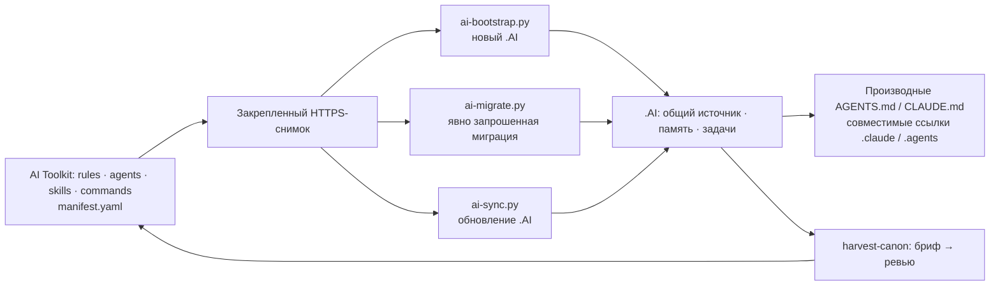

# AI Toolkit

AI Toolkit - агентская ОС для работы над проектами. `.AI/` - единственный поддерживаемый источник инструкций, файловой памяти и Markdown-задач клиента. Claude Code, Codex и Kimi Code подключаются через адаптеры; знания проекта сохраняются при смене агента, а возможности каждой среды проверяются отдельно.

Опыт накапливается в проектах, переиспользуемые находки возвращаются в канон через `harvest-canon`, проходят ревью и доходят до других проектов при обновлении.

**Начать:** [новый проект](#новый-проект) · [обновить `.AI`](#обновить-ai) · [отдельно запросить миграцию](#миграция-в-ai). Первый контракт - Linux и Python 3.11+. macOS и Windows не проверены; DeepSeek без выбранной оболочки не поддерживается.

> **Канон персонализирован под автора.** Сделай [свой форк](#свой-персональный-toolkit), настрой правила под себя и подключай проекты к нему. AI Toolkit - отображаемое имя; адрес репозитория пока остается `dewil/claude-toolkit`.

## Как устроен поток знаний


```mermaid
flowchart LR
    source["AI Toolkit: rules · agents · skills · commands<br/>manifest.yaml"]
    pinned["Закрепленный HTTPS-снимок"]
    source --> pinned
    pinned --> bootstrap["ai-bootstrap.py<br/>новый .AI"]
    pinned --> migrate["ai-migrate.py<br/>явно запрошенная миграция"]
    pinned --> sync["ai-sync.py<br/>обновление .AI"]
    bootstrap --> ai[".AI: общий источник · память · задачи"]
    migrate --> ai
    sync --> ai
    ai --> inputs["Производные AGENTS.md / CLAUDE.md<br/>совместимые ссылки .claude / .agents"]
    ai --> harvest["harvest-canon: бриф → ревью"]
    harvest --> source
```

Новый проект создается через `.AI` bootstrap, установленный `.AI` обновляется через AI sync. Переход со старой раскладки выполняется отдельно и только по явному запросу; bootstrap и sync не мигрируют автоматически. `.AI v1` обозначает `layout_version: 1`; это понятие отдельно от машинной `schema_version` и исторических тегов `canon-vN`. Подробности владения и жизненного цикла приведены в [архитектуре](ARCHITECTURE.md).

## Как начать

Работай из корня проекта-клиента. Агент определяет типы проекта и адаптеры, готовит параметры и закрепляет версию источника. Перед записью он показывает план и получает требуемое разрешение.

### Новый проект

Для проекта без установленного канона попроси Claude Code, Codex или Kimi Code:

```text
Выполни инструкции из https://raw.githubusercontent.com/dewil/claude-toolkit/main/start.md для нового проекта.
```

[Точка входа](start.md) направит в [bootstrap `.AI`](bootstrap/bootstrap-ai.prompt.md). Корень клиента должен существовать. Bootstrap поверх `.claude`, `.AI` или конфликтующих входов не выполняется; контейнер всех рабочих проектов автоматически не сканируется.

### Обновить `.AI`

Используй [canon-sync](skills/canon-sync/SKILL.md); `/canon` также выбирает маршрут по раскладке. Если в старой установке `.AI` навыка еще нет, выполни [закрепленную процедуру AI sync](migrations/ai-sync.prompt.md). [Эксплуатация AI sync](docs/ai-sync.md) описывает план, конфликты, проверку, восстановление и проверку статуса gitleaks. Sync сохраняет идентичность клиента, типы, адаптеры, память и задачи; смена конфигурации требует отдельного перехода.

### Миграция в `.AI`

Если клиент использует старую раскладку, `/canon` сообщает о ней и предлагает отдельно запросить миграцию. Самостоятельно начни [migrate](skills/migrate/SKILL.md) только после такого явного запроса. Claude Code - `/migrate`, Kimi Code - `/migrate` или `/skill:migrate`, Codex - выбор `migrate` в `/skills`.

[Процедура миграции](migrations/ai-layout.prompt.md) описывает аудит, план, архив, применение и recover. Архив сохраняет поддержанные входы; recover продолжает записанную операцию. Миграция не переносит и не меняет нативные настройки, разрешения или секреты.

## Память и продолжение работы

В клиенте-зонтике единица проекта - папка клиента с общим `project_id`; кодовые репозитории подключаются внутри нее. `.AI/project.md` хранит проектный контекст, `.AI/memory/` - устойчивые знания. До выполнения задача получает Markdown-файл в `docs/backlog/`, после приемки он переносится в `docs/done/` с тем же ID. Новый агент читает актуальные файлы и продолжает работу с диска.

`AGENTS.md` и `CLAUDE.md` - производные входы: их собирают из источников `.AI`, а правила и роли доступны через `.AI/START.md`. `.claude/` и `.agents/skills` дают совместимые ссылки. Нативные настройки, разрешения и секреты остаются в своей среде. Свежая сессия каждого адаптера проверяет вход, `project_id`, задачу и запись с повторным чтением общей памяти; наличие файлов само по себе не является такой проверкой.

Файловая память доступна сразу и остается источником истины. Векторный поиск подключается отдельно и может отставать; его отсутствие или ошибка не скрывает локальные файлы. Bootstrap не подключает индексатор и не меняет расписания. См. [границы поиска](docs/memory-search.md).

Переиспользуемую находку выноси навыком [harvest-canon](skills/harvest-canon/SKILL.md) в бриф для ревью канона. Проектная специфика остается в проекте; доставка кандидатов описана в [upstream-inbox](rules/upstream-inbox.md).

## Для каких проектов

Bootstrap спросит тип и добавит специализацию поверх универсального набора:

- **coding** - кодовые проекты любого стека: правила тестов, ошибок, величин и трассируемости требований, агенты `debugger`, `implementer`, `code-reviewer`, скиллы `minimal-code`, `requirements`, `qa-browser`.
- **documentation** - тексты, инструкции и базы знаний: правило стиля документационной страницы, агент `copy-editor`.
- **management** - управленческие проекты и планирование: агент `tracker`, правила встреч, задач, оценок, сверки имен и биллинга, интеграции с Telegram, Redmine, Meet и Asana.
- **education** - учебные материалы и конспекты: агент `note-taker`, правила конспектов и ДЗ, скиллы `tutor` и `local-transcription`.
- **wiki** - Obsidian-vault'ы: правила формата заметок и перелинковки, агенты `note-writer` и `librarian`.

Проект может сочетать типы, например `wiki`, `coding` и `documentation`.

Единица проекта - не обязательно Git-репозиторий. В топологии [клиент-зонтик](rules/client-umbrella.md) сессии и общая память находятся в корне клиента, а кодовые репозитории подключены детьми через мульти-рут workspace. Для Claude Code используйте ASCII-токен в имени папки клиента, чтобы избежать коллизий слотов памяти.

## Свой персональный toolkit

1. Сделай форк и настрой `rules/`, `agents/`, `skills/`, `commands/`. Раскатываемые файлы регистрируются в [manifest.yaml](manifest.yaml), начальные локальные документы и policy `.AI` находятся в [templates/ai](templates/ai).
2. Для новых клиентов используй `start.md` форка. Для обновлений проверь [canon-sync](skills/canon-sync/SKILL.md), [команду canon](commands/canon.md), [AI sync](migrations/ai-sync.prompt.md) и [инструкцию эксплуатации](docs/ai-sync.md). Клиенты с сохраненным HTTP-источником обновляются из него.
3. Подключай проекты к своему входу. Историю прежней раскладки можно найти в Git; для перехода используй отдельную миграцию.

## SDD и безопасность

Намерение и независимые критерии фиксируются до реализации, а завершенное изменение проходит фактическую сверку и полный CI. Навык [sdd](skills/sdd/SKILL.md) начинает или продолжает работу; [инструкция](docs/sdd.md) описывает передачу между сессиями.

План предшествует применению, локальные конфликты требуют решения, восстановление выполняет владелец соответствующего журнала. Проект получает закрепленный HTTP-снимок; соседний клон автоматически не используется. Внешние действия требуют разрешений проекта независимо от зеленых проверок. Полный CI запускается через `python3 scripts/run-tests.py`.

## Структура

- `start.md` - точка входа для нового проекта, обновления и явно запрошенной миграции.
- `bootstrap/` - `.AI` bootstrap.
- `rules/` - канонические правила поведения агентов.
- `agents/` - канонические описания ролей и субагентов.
- `skills/` - канонические скиллы.
- `commands/` - канонические команды, включая `/canon` для sync.
- `scripts/` - bootstrap, migrate, sync и канонические скрипты для проектов (`gitleaks-hook.py`, `md-pdf.py`, `session-cost.py`, инструменты зеркалирования источников и другое).
- `tests/` - проверки bootstrap, migrate, sync и канонических скриптов.
- `templates/` - начальные скелеты; проект владеет контекстом, памятью и policy. `.AI/START.md` - управляемый каталог, обновляемый AI sync.
- `migrations/` - отдельная миграция и закрепленная процедура AI sync.
- `manifest.yaml` - единственный реестр раскатываемых канон-файлов.
- `CLAUDE.md` - агентский контекст для работы над этим репозиторием; импортирует README.

## Лицензия

[MIT](LICENSE). Сохраняй copyright-уведомление в производных копиях.
