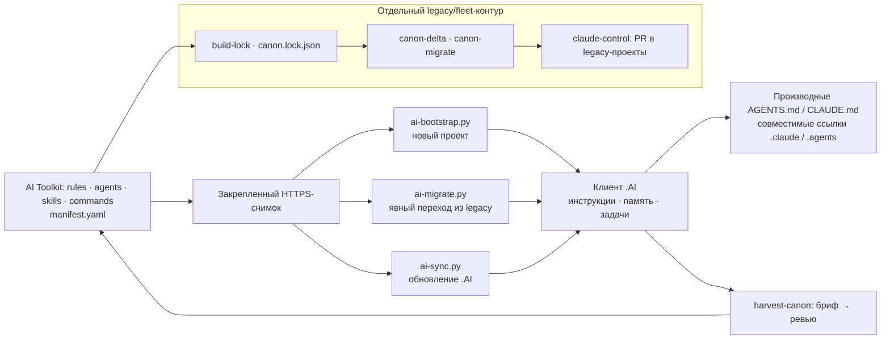

# AI Toolkit

Персональный канон и инструменты для работы AI-агентов с проектами. Общие инструкции, файловая память и Markdown-задачи живут в `.AI/`: Claude Code, Codex и Kimi Code подключаются через нативные адаптеры и продолжают работу из одного источника знаний.

Опыт накапливается в проектах, переиспользуемые находки возвращаются в канон через `harvest-canon`, затем доходят до других проектов с обновлением. Знания проекта сохраняются при смене агента; возможности и разрешения каждой среды проверяются отдельно.

**Начать:** [новый проект](#новый-проект) · [обновить `.AI`](#обновить-ai) · [мигрировать legacy](#мигрировать-legacy-в-ai). Первый контракт - Linux/Python 3.11+; macOS/Windows не проверены, оболочка DeepSeek не выбрана.

> **Канон персонализирован под автора.** Сделай [свой форк](#свой-персональный-toolkit), настрой правила под себя и подключай проекты к нему. AI Toolkit - отображаемое имя; адрес репозитория пока остается `dewil/claude-toolkit`.

## Как устроен поток знаний


```mermaid
flowchart LR
    source["AI Toolkit: rules · agents · skills · commands<br/>manifest.yaml"]
    pinned["Закрепленный HTTPS-снимок"]
    source --> pinned
    pinned --> bootstrap["ai-bootstrap.py<br/>новый проект"]
    pinned --> migrate["ai-migrate.py<br/>явный переход из legacy"]
    pinned --> sync["ai-sync.py<br/>обновление .AI"]
    bootstrap --> ai["Клиент .AI<br/>инструкции · память · задачи"]
    migrate --> ai
    sync --> ai
    ai --> inputs["Производные AGENTS.md / CLAUDE.md<br/>совместимые ссылки .claude / .agents"]
    ai --> harvest["harvest-canon: бриф → ревью"]
    harvest --> source
    subgraph legacy["Отдельный legacy/fleet-контур"]
        release["build-lock · canon.lock.json"]
        delta["canon-delta · canon-migrate"]
        fleet["claude-control: PR в legacy-проекты"]
        release --> delta --> fleet
    end
    source --> release
```

Bootstrap создает общий источник, миграция сохраняет старое состояние и переводит его в `.AI`, sync обновляет установленный канон с сохранением локальных знаний. Legacy/fleet обслуживает прежнюю раскладку; его проверки не доказывают массовую раскатку `.AI`. Детали владения и транзакций - в [архитектуре](ARCHITECTURE.md).

## Как начать

Открой выбранного агента в корне клиента. Агент определяет типы проекта и адаптеры, готовит параметры и закрепляет версию источника; вручную собирать идентификаторы и хеши не требуется. До записи покажет конкретный план и получит разрешение, если оно еще не дано.

### Новый проект

Для проекта без установленного канона скажи Claude Code, Codex или Kimi Code:

```text
Выполни инструкции из https://raw.githubusercontent.com/dewil/claude-toolkit/main/start.md для нового проекта.
```

[Точка входа](start.md) направит в [bootstrap `.AI`](bootstrap/bootstrap-ai.prompt.md). Корень клиента должен существовать. Bootstrap поверх `.claude`, `.AI` или конфликтующих входов не выполняется; контейнер всех рабочих проектов автоматически не сканируется.

### Обновить `.AI`

Попроси агента использовать [canon-sync](skills/canon-sync/SKILL.md); `/canon` также выбирает маршрут по раскладке. Если в старой установке `.AI` навыка еще нет, скажи:

```text
Выполни https://raw.githubusercontent.com/dewil/claude-toolkit/main/migrations/ai-sync.prompt.md для обновления этого клиента.
```

Discovery-ссылка на `main` закрепляется процедурой до исполнения. [Эксплуатация AI sync](docs/ai-sync.md) описывает план, конфликты, проверку и восстановление. Sync сохраняет ID, типы, адаптеры, память и задачи; смена конфигурации требует отдельного перехода.

### Мигрировать legacy в `.AI`

Явно попроси переход через навык [migrate](skills/migrate/SKILL.md): Claude Code - `/migrate`, Kimi Code - `/migrate` или `/skill:migrate`, Codex - выбор `migrate` в `/skills`. Если навык не обнаружен, попроси прочитать его по ссылке; в старом клиенте он может лежать в `.claude/skills/migrate/SKILL.md`.

[Процедура миграции](migrations/ai-layout.prompt.md) содержит аудит, поддерживаемую старую раскладку, план с архивом, применение и recover. Поддержан старый монолитный `.claude/canon.yaml`; split registry и существующий `.agents` требуют другого адаптера. При блокировке окружением агент готовит одну команду для обычного терминала по разделу "Одна команда в обычном терминале" той же процедуры. Архив сохраняется; recover завершает записанную операцию, автоматический rollback не обещается.

Для сохранения legacy используй [прежний sync](migrations/sync-from-canon.prompt.md). Миграция автоматически из обновления не запускается.

## Память и продолжение работы

`.AI/project.md` хранит контекст клиента, `.AI/memory/` - устойчивые знания. До выполнения задача получает Markdown-владельца в `docs/backlog/`: цель, ограничения, прогресс, проверки и следующий шаг записываются сразу. После приемки файл переносится в `docs/done/` с тем же ID. Новый агент читает эти файлы и продолжает работу с диска.

`AGENTS.md` для Codex/Kimi и `CLAUDE.md` для Claude - производные входы. Править нужно источники и пересобирать входы через `build`; правила и роли доступны через `.AI/START.md`. Нативные настройки, разрешения и секреты остаются в своей среде. Для каждого адаптера нужна свежая сессия с проверкой входа, project_id, задачи и записи/повторного чтения общей памяти: наличие файлов и успешный `check` этого не доказывают.

Файловая память доступна сразу. Векторный поиск на Linux требует отдельного подключения локального backend; доступ к нему из ограниченных сессий еще дорабатывается. Автоматическое подключение индекса или готовый универсальный MCP-доступ не заявляются. Bootstrap не запускает индексатор, не меняет расписание и не подключает глобальную нативную автопамять.

Переиспользуемую находку выноси навыком [harvest-canon](skills/harvest-canon/SKILL.md) в бриф для ревью канона. Проектная специфика остается в проекте; доставка кандидатов описана в [upstream-inbox](rules/upstream-inbox.md). После принятия находка распространяется обычным обновлением.

## Для каких проектов

Не только про код. Bootstrap спросит тип и докинет специализацию поверх универсального набора:

- **coding** - кодовые проекты любого стека: правила тестов, обработки ошибок, формата величин и трассируемости требований, агенты `debugger`, `implementer`, `code-reviewer`, скиллы `minimal-code`, `requirements` (сбор размытых требований в ТЗ до кода), `qa-browser`.
- **documentation** - тексты, инструкции, базы знаний: правило стиля документационной страницы, агент `copy-editor`.
- **management** - управленческие проекты, планирование: агент `tracker`, правила встреч/задач/оценок, сверки имен и биллинга AI-работы, скиллы зеркалирования внешних источников (`telegram-snapshot`, `redmine-snapshot`, `mymeet-snapshot`), отправки в Telegram, чтения ленты комментариев Asana в обход потолка MCP (`asana-comments`), пакетного разворачивания доски Asana из JSON-плана (`asana-project`), локальной транскрипции и калибровочной оценки трудоемкости (`estimate-calibration`).
- **education** - учебные материалы, конспекты: агент `note-taker`, правила конспектов/ДЗ, скиллы `tutor` и `local-transcription`.
- **wiki** - Obsidian-vault'ы: правила формата заметки и перелинковки, агенты `note-writer` и `librarian` (ревизия vault'а на битые ссылки/дубли/сироты), Telegram-зеркалирование - общее с management.

Проект может быть **мультиспециализированным**: vault со встроенной кодовой частью возьмет сразу `wiki`, `coding` и `documentation` - специализации накладываются друг на друга.

Единица проекта - не обязательно git-репозиторий. Для заказчика с несколькими направлениями (управление + код + документация) канонизирована топология **"клиент-зонтик"** (`rules/client-umbrella.md`): проект = папка клиента, сессии и память живут в ее корне, а код-репозитории подключаются детьми через мульти-рут workspace. Обязательный компаньон - ASCII-токен в имени папки: без него соседние не-ASCII папки равной длины молча делят один слот памяти Claude Code.

## Свой персональный toolkit

1. Сделай форк репозитория и настрой канон: `rules/`, `agents/`, `skills/`, `commands/`. Раскатываемые файлы регистрируются в [manifest.yaml](manifest.yaml), начальные локальные документы и политика `.AI` - в [templates/ai](templates/ai).
2. Для новых клиентов используй `start.md` своего форка: URL входа задает HTTP-источник bootstrap. Для обновлений проверь продуктовые defaults в [canon-sync](skills/canon-sync/SKILL.md), [команде canon](commands/canon.md), [процедуре AI sync](migrations/ai-sync.prompt.md) и [ее инструкции](docs/ai-sync.md). Клиенты с сохраненным HTTP-источником обновляются из него; нативные settings и секреты настраиваются отдельно.
3. Опубликуй свою версию и подключай проекты к ее входу. Если сохраняешь legacy-маршрут, его адреса и шаблоны настраиваются отдельно в `bootstrap-01/02/03` и legacy-реестре.

## SDD и безопасность

Канон применяет SDD ко всем изменениям: намерение и независимые проверки до реализации, сверка другой фактической моделью перед закрытием, задача и результаты на диске. Роли сохраняют ограничения своей среды. Навык [sdd](skills/sdd/SKILL.md) начинает или продолжает работу; [инструкция](docs/sdd.md) описывает передачу между сессиями. Протокол не является автоматическим оркестратором.

План предшествует применению, локальные конфликты требуют решения, восстановление выполняет владелец соответствующего журнала. Проект получает закрепленный HTTP-снимок; соседний клон автоматически не используется. Публикация и внешние действия требуют проектных разрешений независимо от зеленых проверок. Полный CI запускается через `python3 scripts/run-tests.py`.

## Legacy/fleet: техническая справка

[claude-control](https://github.com/dewil/claude-control) - отдельная инфраструктура оператора legacy-парка. [Fleet rollout](docs/fleet-rollout.md) описывает релизы и получателей; эти механизмы сохраняются для прежних клиентов.

<details>
<summary>Движок доставки, release identity и проверка транзакций</summary>

### Детерминированный legacy-движок

Инструменты отдельного legacy/fleet-контура. Канон-синк перестает быть LLM-миссией (десятки тысяч токенов на no-op) и становится чистым дельта-скриптом над **immutable release-дескриптором**.

- **`scripts/build-lock.py`** - генератор `canon.lock.json`: blob_sha + mode каждого файла из git-дерева, membership по типам, `manifest_digest`. Плюс server-side gate (`--check`), который CI гоняет на теге `canon-vN`. Identity релиза = **git commit_sha** аннотированного тега, не содержимое: одна и та же зафиксированная ревизия раскатывается везде.
- **`scripts/canon-delta.py`** (~73 КБ) - транзакционный движок применения. UNION-классификатор (10 классов), **трехстороннее сравнение** (база / локальная копия / канон - отличить "правил под себя" от "канон ушел вперед"), планировщик, и **WAL** с crash-матрицей: prepare -> commit -> clear, recovery roll-forward/back, CAS перед rename, no-clobber на чужие файлы, containment записи в пределах проекта, atomic temp+rename. Разрешение конфликтов - явным API (accept per-path / keep-local / skip), а не молчаливым сваливанием.
- **`scripts/canon-migrate.py`** - одноразовое расщепление старого монолита `canon.yaml` (sha256) на `intent` (человек: тип/трек/оверрайды) / `state.json` (машина: git-blob-sha, rollout_record, резолюции) / `ledger` (harvester upstream_pending).
- **`.github/workflows/`** - `canon-tests` (прогон движка на каждый push) + `canon-release` (build-lock + gate на теге, публикация lock как release-asset).
- **Изоляция.** Канон тянется **только по HTTP** с закоммиченного `main` (или из git-зеркала по commit_sha) - даже если клон toolkit лежит соседней папкой, проект его не ищет. Везде одна зафиксированная версия, а не чье-то рабочее дерево.

Как выпустить релиз, как проект попадает в парк и какими ключами он там описывается - [docs/fleet-rollout.md](./docs/fleet-rollout.md). Там же про то, почему тег сам по себе никуда не едет: он фиксирует **что** раскатывать, а список получателей живет отдельно.

**Как это верифицировано.** Транзакционный слой не "полируется на бумаге" - он вынесен в §10-контракт и доказывается **fault-injection тестами**: `tests/` - stdlib-тесты движка и канонических скриптов, включая crash-матрицу WAL и по регресс-тесту на **каждую** находку состязательного (adversarial) ревью. Движок прошел несколько раундов adversarial-верификации второй моделью до GO; путь-маппинг проекта (канон под `.claude/`, `scripts/` в корне) отдельно закрыл 4 раунда находок (path traversal, алиас-коллизии на case-insensitive ФС, потеря правок на legacy-раскладке) - каждая с фиксом и тестом.

</details>

## Структура

- `start.md` - точка входа: новый проект / обновление / явная миграция.
- `bootstrap/` - новый `bootstrap-ai`; legacy-цепочка `bootstrap-01/02/03`.
- `rules/` - канонические правила поведения агентов.
- `agents/` - канонические описания ролей и субагентов.
- `skills/` - канонические скиллы, папка на скилл.
- `commands/` - канонические слэш-команды (`/canon` = sync).
- `scripts/` - **механика `.AI`** (`ai-bootstrap.py`, `ai-migrate.py`, `ai-sync.py`); legacy/fleet: движок канон-синка `build-lock.py` / `canon-delta.py` / `canon-migrate.py` (не распространяется в проекты - это оснастка); канонические скрипты для проектов (`codex-sandbox.py` - запуск codex только в песочнице bwrap, `gitleaks-hook.py` - проверка и установка pre-commit gitleaks, `md-pdf.py`, `session-cost.py`, зеркалирование `telegram-*`/`redmine-*`/`mymeet-*`).
- `tests/` - stdlib-тесты: движок (crash-матрица и регрессии по adversarial-находкам) и канонические скрипты для проектов.
- `.github/workflows/` - CI: `canon-tests`, `canon-release`.
- `templates/` - начальные скелеты; проект владеет контекстом, памятью и policy. `.AI/START.md` - исключение: управляемый каталог, обновляемый AI sync.
- `migrations/` - одноразовые промты апгрейда (в т.ч. `sync-from-canon`).
- `manifest.yaml` - полный список канон-файлов по типам, с однострочным описанием. Единственный реестр: bootstrap и sync тянут списки отсюда.
- `CLAUDE.md` - агентский контекст для Claude, работающего внутри этого репо (правка канона); импортирует этот README.

## Лицензия

[MIT](LICENSE). Сохраняй copyright-уведомление в производных копиях.
