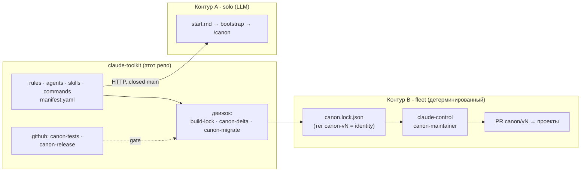

# claude-toolkit

Персональный канон правил, агентов и скиллов для [Claude Code](https://claude.com/claude-code) - плюс детерминированный, транзакционный движок, который упаковывает его в immutable-релизы и раскатывает по проектам без потери локальных правок.

**Правила · агенты · скиллы · 5 типов проектов · доставка по HTTP**

> Половина системы из двух репозиториев. Второй - [**claude-control**](https://github.com/dewil/claude-control): автономная инфраструктура поверх Claude Code, чей fleet-reconciler потребляет движок этого репо, чтобы раскатывать канон по парку проектов через pull request'ы. Здесь - источник канона и движок его доставки; там - оператор, который это исполняет.

> [!IMPORTANT]
> **Этот канон сильно персонализирован под меня** - мои правила, агенты, конвенции, привычки. Это не универсальный дистрибутив. Хочешь такой же инструмент - **сделай свою копию и пройди первичную настройку под себя** (см. [Свой персональный toolkit](#свой-персональный-toolkit)), а не подключай проекты к моему канону: приедут мои решения, и они могут тебе не подойти. Ценность здесь - в **механике** (движок, модель релизов, дисциплина верификации), а не в конкретных правилах.

## Зачем

Claude Code из коробки - чистый помощник без памяти о твоих привычках. Чтобы он вел себя предсказуемо, на каждый проект приходится заново писать правила, объяснять конвенции, описывать субагентов, настраивать память - полдня на проект. А правило, отлаженное в одном месте, не доезжает до остальных: опыт не копится.

`claude-toolkit` держит канон в одном месте и раскатывает его двумя контурами - в зависимости от того, solo это или автоматический парк.


```mermaid
flowchart LR
    subgraph repo["claude-toolkit (этот репо)"]
      canon["rules · agents · skills · commands<br/>manifest.yaml"]
      engine["движок:<br/>build-lock · canon-delta · canon-migrate"]
      ci[".github: canon-tests · canon-release"]
      canon --> engine
      ci -. gate .-> engine
    end

    subgraph solo["Контур A - solo (LLM)"]
      start["start.md → bootstrap → /canon"]
    end
    subgraph fleet["Контур B - fleet (детерминированный)"]
      lock["canon.lock.json<br/>(тег canon-vN = identity)"]
      maint["claude-control<br/>canon-maintainer"]
      pr["PR canon/vN → проекты"]
    end

    canon -->|"HTTP, closed main"| start
    engine --> lock
    lock --> maint --> pr
```

- **Новые проекты** получают общий источник `.AI/` через детерминированный `ai-bootstrap.py`; агент готовит план и проверяет подключение среды. **Legacy solo** сохраняет `.claude/` и трехсторонний sync (`/canon`). Эти два формата не смешиваются.
- **Контур B - fleet, детерминированный движок.** Канон собирается в immutable release-дескриптор (`canon.lock.json`, identity = git commit_sha аннотированного тега), и [claude-control](https://github.com/dewil/claude-control) раскатывает его по парку через PR-ы дельта-движком с транзакционным WAL - **без LLM в data-plane**. См. [Детерминированный движок](#детерминированный-движок).

## Что это дает

- **Быстрый старт.** Новый проект готов за минуты - сразу с типографикой, агентами и правилами под свой тип, без копипасты снипетов.
- **Накопление опыта.** Найденное в одном проекте правило переезжает в канон и через синк доходит до остальных. Эффект растет с числом проектов.
- **Согласованность.** Claude ведет себя одинаково во всех проектах - одни конвенции, одни агенты.
- **Специализация под тип.** Кодовый проект получает правила тестов и обработки ошибок, документационный - copy-editor. Лишнее не тянется.
- **Под контролем.** Канон - явные снимки по HTTP с закоммиченного `main`. Правка - только после "ок". На свежем проекте синк отрабатывает как no-op (для fleet-движка это буквально 0 вызовов LLM).

## Для каких проектов

Не только про код. Bootstrap спросит тип и докинет специализацию поверх универсального набора:

- **coding** - кодовые проекты любого стека: правила тестов, обработки ошибок, формата величин и трассируемости требований, агенты `debugger`, `implementer`, `code-reviewer`, скиллы `minimal-code`, `requirements` (сбор размытых требований в ТЗ до кода), `qa-browser`.
- **documentation** - тексты, инструкции, базы знаний: правило стиля документационной страницы, агент `copy-editor`.
- **management** - управленческие проекты, планирование: агент `tracker`, правила встреч/задач/оценок, сверки имен и биллинга AI-работы, скиллы зеркалирования внешних источников (`telegram-snapshot`, `redmine-snapshot`, `mymeet-snapshot`), отправки в Telegram, чтения ленты комментариев Asana в обход потолка MCP (`asana-comments`), пакетного разворачивания доски Asana из JSON-плана (`asana-project`), локальной транскрипции и калибровочной оценки трудоемкости (`estimate-calibration`).
- **education** - учебные материалы, конспекты: агент `note-taker`, правила конспектов/ДЗ, скиллы `tutor` и `local-transcription`.
- **wiki** - Obsidian-vault'ы: правила формата заметки и перелинковки, агенты `note-writer` и `librarian` (ревизия vault'а на битые ссылки/дубли/сироты), Telegram-зеркалирование - общее с management.

Проект может быть **мультиспециализированным**: vault со встроенной кодовой частью возьмет сразу `wiki`, `coding` и `documentation` - специализации накладываются друг на друга.

Единица проекта - не обязательно git-репозиторий. Для заказчика с несколькими направлениями (управление + код + документация) канонизирована топология **"клиент-зонтик"** (`rules/client-umbrella.md`): проект = папка клиента, сессии и память живут в ее корне, а код-репозитории подключаются детьми через мульти-рут workspace. Обязательный компаньон - ASCII-токен в имени папки: без него соседние не-ASCII папки равной длины молча делят один слот памяти Claude Code.

## Быстрый старт - новый проект

Открой Claude Code в корне нового проекта и скажи:

```
выполни инструкции из https://raw.githubusercontent.com/dewil/claude-toolkit/main/start.md
```

Агент перейдет в [bootstrap-ai](bootstrap/bootstrap-ai.prompt.md): определит корень клиента, типы и адаптеры, закрепит HTTP-источник за 40-символьным commit SHA и покажет план. `main` годится для входного промта, но не для исполняемой установки. Локальный клон автоматически не ищется.

Новый маршрут рассчитан на Linux/Python 3.11+ и новый проект: существующие `.AI`, `.claude`, `.agents`, AGENTS.md/CLAUDE.md и конфликтующие скрипты не мигрируются. Повтор совпадающей установки - no-op. Корень клиента должен существовать; контейнер Work автоматически не сканируется.

```text
python3 ai-bootstrap.py plan --root ROOT --source-base PINNED_HTTPS_URL --project-id UUID --types coding,wiki --adapters claude,codex,kimi
python3 ai-bootstrap.py apply --root ROOT --source-base PINNED_HTTPS_URL --project-id UUID --types coding,wiki --adapters claude,codex,kimi
python3 ai-bootstrap.py check --root ROOT
python3 ai-bootstrap.py build --root ROOT
python3 ai-bootstrap.py recover --root ROOT
```

Скрипт скачивается из того же закрепленного источника. `--bundle DIR` вместо `--source-base` - только явно предоставленный снимок для разработки/офлайн-проверок. Plan валидирует полный пакет без записи; apply применяет согласованный план; build пересобирает входы из источников; check выявляет устаревание/конфликт; recover завершает прерванную транзакцию. Успех - код 0, stale/conflict у check - 1, ошибка - 2.

`manifest.yaml` задает union universal и выбранных типов. Источники сохраняются точными байтами: rules/skills/commands в `.AI/`, agents в `.AI/roles/`, scripts в `scripts/`. Совместимые `.claude/{rules,skills,agents,commands,memory}` и `.agents/skills` - ссылки на `.AI`. Идентичность клиента - `.AI/project.json`; один новый state - `.AI/canon/canon.state.json`, intent - `.AI/canon/canon.intent.yaml` (JSON-подмножество YAML). Локальные шаблоны project.md и памяти принадлежат проекту.

AGENTS.md (codex/kimi) и CLAUDE.md (claude) генерируются: обязательные правила включаются целиком в пределах context-policy (30000 байт), остальные доступны через каталог START. Локальный `.AI/project.md` и память не встраиваются во вход; агент читает их напрямую. Править нужно источники с последующим build; ручная правка результата блокирует сборку. `.gitignore` дополняется с сохранением пользовательских строк; уже отслеживаемые приватные назначения дают отказ.

Каждая задача имеет Markdown-владельца до выполнения, по умолчанию в `docs/backlog/`; прогресс и проверки сохраняются сразу, завершенное переносится в `docs/done/` с тем же ID. Общая память клиента - `.AI/memory/`, durable-факты сохраняются по ходу работы. Новая `.AI` автоматически не подключается к глобальному векторному индексу. Индексатор не запускается; после отдельного подключения периодическая Linux-индексация может отставать. До подключения агент работает по файловой памяти с явным ограничением поиска.

Входы не означают проверенное поведение среды. Для каждого адаптера нужна свежая сессия из корня с проверкой входа, ID, задачи и записи/повторного чтения общей памяти. Нативная глобальная автопамять автоматически не подключается, до отдельной проверки используется явная файловая память. Настройки, разрешения и секреты агентов не копируются. macOS/Windows не проверены; DeepSeek без выбранной оболочки отвергается.

**Общий sync `.AI` пока не реализован.** Старые `/canon`, canon-delta, canon-migrate и sync/bootstrap-промты отказываются при `.AI` или `.ai-bootstrap`; не обходи этот гейт. Legacy 01/02/03 остаются для явно выбранного старого маршрута.

## Отдельная миграция legacy в .AI

После миграции проверь передачу задачи по общей файловой памяти между свежими сессиями выбранных агентов. Фиксируй фактические среды; повторный Codex допустим для проверки возобновления, но не заменяет проверку Claude или DeepSeek. Порядок ручного теста описан в процедуре миграции.

По явному запросу на переход используй [ai-layout](migrations/ai-layout.prompt.md): audit -> read-only plan -> согласованное apply. Bootstrap нового проекта поверх `.claude` не запускается. Для новой миграции адаптер поддерживает только старый монолитный `.claude/canon.yaml` плюс `.claude/` и `CLAUDE.md`; split registry, существующий `.agents`, чужая `.AI` и неизвестный state дают отказ. Сначала проверяются журналы и завершенная миграция: recovery и успешный check завершенного поколения используют сохраненные ID/config, без нового UUID или legacy prerequisites.

Скачай `scripts/ai-migrate.py` и его компаньон `scripts/ai-bootstrap.py` из одного pinned HTTPS revision в соседние файлы временного каталога вне клиента. Для явно предоставленного офлайн bundle оба скрипта берутся из того же снимка. Типы, адаптеры и UUID фиксируются для plan/apply:

```text
python3 /tmp/MIGRATION/scripts/ai-migrate.py plan --root ROOT --source-base PINNED_HTTPS_URL --project-id UUID --types coding,wiki --adapters claude,codex,kimi
python3 /tmp/MIGRATION/scripts/ai-migrate.py apply --root ROOT --source-base PINNED_HTTPS_URL --project-id UUID --types coding,wiki --adapters claude,codex,kimi
python3 /tmp/MIGRATION/scripts/ai-migrate.py check --root ROOT
python3 /tmp/MIGRATION/scripts/ai-migrate.py recover --root ROOT
```

`--bundle DIR` заменяет `--source-base` только для явного bundle; автоматического поиска клона нет. Plan не пишет в клиент, CLI возвращает 0 при успехе и 2 при отказе. Память и неизвестные локальные файлы сохраняются; локальные правки и exclusions не обновляются поверх каноном. Истинные upstream-базы хранятся отдельно от retained/local-only. Старые `.claude`, root-входы и `docs/dev` сохраняются в `.ai-bootstrap/legacy/`, backup остается после успеха. `docs/dev` переносится в `docs` только без коллизий. Приватные контекст и память остаются локальными источниками, generated входы их не встраивают.

При `.ai-bootstrap/migration.json` используется только `ai-migrate.py recover`: он завершает записанное поколение без сети и отказывает при неожиданных правках. Это roll-forward, автоматический rollback не обещается. Bootstrap/check/build/recover отказываются при migration journal. Повтор той же завершенной миграции с теми же ID/config/source - no-op; чужое состояние и новая конфигурация не перезаписываются.

Linux/Python 3.11+ - первый контракт. Нативный слот автопамяти, векторный индекс и расписание не меняются; fresh-agent проверки и публикация на main не следуют из локального check. Проверки разработки и восстановления выполняются на временных копиях, исходный клиент не меняется. Общий sync `.AI` по-прежнему отсутствует.

## Обновление существующего legacy-проекта (solo)

Если проект уже бутстрапленный (в `.claude/` есть канон-реестр), открой в его корне Claude Code и запусти:

```
/canon
```

Агент прочитает реестр, скачает актуальный канон, опишет расхождения по каждому файлу и спросит, что накатить; через `manifest.yaml` проверит, не появились ли новые файлы под тип проекта. Это **контур A** (LLM). Для автоматической раскатки по парку работает **контур B** - детерминированный движок ниже.

## Детерминированный движок

Сердцевина контура B и самая плотная инженерия репо. Канон-синк перестает быть LLM-миссией (десятки тысяч токенов на no-op) и становится чистым дельта-скриптом над **immutable release-дескриптором**.

- **`scripts/build-lock.py`** - генератор `canon.lock.json`: blob_sha + mode каждого файла из git-дерева, membership по типам, `manifest_digest`. Плюс server-side gate (`--check`), который CI гоняет на теге `canon-vN`. Identity релиза = **git commit_sha** аннотированного тега, не содержимое: одна и та же зафиксированная ревизия раскатывается везде.
- **`scripts/canon-delta.py`** (~73 КБ) - транзакционный движок применения. UNION-классификатор (10 классов), **трехстороннее сравнение** (база / локальная копия / канон - отличить "правил под себя" от "канон ушел вперед"), планировщик, и **WAL** с crash-матрицей: prepare -> commit -> clear, recovery roll-forward/back, CAS перед rename, no-clobber на чужие файлы, containment записи в пределах проекта, atomic temp+rename. Разрешение конфликтов - явным API (accept per-path / keep-local / skip), а не молчаливым сваливанием.
- **`scripts/canon-migrate.py`** - одноразовое расщепление старого монолита `canon.yaml` (sha256) на `intent` (человек: тип/трек/оверрайды) / `state.json` (машина: git-blob-sha, rollout_record, резолюции) / `ledger` (harvester upstream_pending).
- **`.github/workflows/`** - `canon-tests` (прогон движка на каждый push) + `canon-release` (build-lock + gate на теге, публикация lock как release-asset).
- **Изоляция.** Канон тянется **только по HTTP** с закоммиченного `main` (или из git-зеркала по commit_sha) - даже если клон toolkit лежит соседней папкой, проект его не ищет. Везде одна зафиксированная версия, а не чье-то рабочее дерево.

Как выпустить релиз, как проект попадает в парк и какими ключами он там описывается - [docs/fleet-rollout.md](./docs/fleet-rollout.md). Там же про то, почему тег сам по себе никуда не едет: он фиксирует **что** раскатывать, а список получателей живет отдельно.

**Как это верифицировано.** Транзакционный слой не "полируется на бумаге" - он вынесен в §10-контракт и доказывается **fault-injection тестами**: `tests/` - 970 stdlib-тестов, из них 110 - движок, включая crash-матрицу WAL и по регресс-тесту на **каждую** находку состязательного (adversarial) ревью. Движок прошел несколько раундов adversarial-верификации второй моделью до GO; путь-маппинг проекта (канон под `.claude/`, `scripts/` в корне) отдельно закрыл 4 раунда находок (path traversal, алиас-коллизии на case-insensitive ФС, потеря правок на legacy-раскладке) - каждая с фиксом и тестом.

## Обратный поток - upstream

Полезное, родившееся в конкретном проекте, выносится обратно в канон: бриф собирает синк или скилл `harvest-canon` (в конце любой задачи, где всплыл переиспользуемый прием). Это самодостаточный артефакт в `toolkit-log/upstream-pending/`, который можно скормить Claude в клоне toolkit, отревьюить и закоммитить. Доставка автоматизирована машинным inbox: копия брифа кладется в `~/.claude/canon-inbox/` - не важно, оформил его скилл, синк или сессия руками (`rules/upstream-inbox.md`), - и сессия в клоне разбирает очередь по фразе "разбери inbox", пути к брифам руками не переносятся. Проект ничего не знает, где на машине лежит клон - связь строго односторонняя, через явные артефакты. На следующем синке проект видит, что правило доехало, и чистит пометку. В fleet-контуре harvester [claude-control](https://github.com/dewil/claude-control) автоматизирует сбор таких кандидатов.

## Как это устроено (5 минут)

Маршрут для того, кто хочет посмотреть код, а не пользоваться инструментом:

1. **[`manifest.yaml`](./manifest.yaml)** - единственный реестр канона: что за файл и к какому типу проекта относится, одной строкой. Отсюда bootstrap и sync берут списки, поэтому новый файл достаточно добавить сюда - в промтах он нигде не перечисляется руками.
2. **[`scripts/canon-delta.py`](./scripts/canon-delta.py)** - ядро: UNION-классификатор на 10 классов, трехстороннее сравнение и WAL с recovery. Начинать с классификатора: он задает язык, которым описан весь остальной движок.
3. **[`tests/`](./tests/)** - 970 stdlib-тестов (110 из них - движок), включая crash-матрицу WAL и по регресс-тесту на каждую находку состязательного ревью. Инварианты движка быстрее всего считываются именно отсюда.
4. **[`CLAUDE.md`](./CLAUDE.md)** - агентский контекст: как устроен сам репозиторий и по каким правилам в него вносятся изменения.

Что здесь нетипичного: трехстороннее сравнение вместо бинарного diff (позволяет отличить "проект правил файл под себя" от "канон ушел вперед"), идентичность релиза по git commit_sha, а не по содержимому, и data-plane без LLM - модель поднимается только на разрешение конфликтов.

## Принципы

- **Идемпотентность** - любой промт и любой проход движка безопасны при повторе.
- **Audit -> plan -> "ок" -> action** - изменения только после явного подтверждения (в solo) или через PR с ревью человеком (в fleet).
- **Изоляция** - проект не знает про filesystem-расположение клона toolkit; канон только по HTTP/commit_sha.
- **Канон в одном экземпляре** - правила и агенты живут только здесь, не дублируются heredoc'ом.
- **Детерминизм** - в data-plane никакого LLM; он поднимается только on-demand на разрешение конфликтов.

## Структура

- `start.md` - точка входа (тонкий роутер, контур A).
- `bootstrap/` - новый `bootstrap-ai`; legacy-цепочка `bootstrap-01/02/03`.
- `rules/` - канонические правила поведения агентов.
- `agents/` - канонические описания субагентов (14).
- `skills/` - канонические скиллы, папка на скилл (31).
- `commands/` - канонические слэш-команды (`/canon` = sync).
- `scripts/` - **две вещи разной природы**: (1) движок канон-синка `build-lock.py` / `canon-delta.py` / `canon-migrate.py` (не распространяется в проекты - это оснастка); (2) канонические скрипты для проектов (`codex-sandbox.py` - запуск codex только в песочнице bwrap, `gitleaks-hook.py` - проверка и установка pre-commit gitleaks, `md-pdf.py`, `session-cost.py`, зеркалирование `telegram-*`/`redmine-*`/`mymeet-*`).
- `tests/` - stdlib-тесты (970): движок (110, crash-матрица + регресс на каждую adversarial-находку) и канонические скрипты для проектов.
- `.github/workflows/` - CI: `canon-tests`, `canon-release`.
- `templates/` - скелеты с TODO-заглушками, копируются в проект один раз; дальше проект владеет ими сам.
- `migrations/` - одноразовые промты апгрейда (в т.ч. `sync-from-canon`).
- `manifest.yaml` - полный список канон-файлов по типам, с однострочным описанием. Единственный реестр: bootstrap и sync тянут списки отсюда.
- `CLAUDE.md` - агентский контекст для Claude, работающего внутри этого репо (правка канона); импортирует этот README.

## Свой персональный toolkit

Репо рассчитан на форк под себя - свои правила, свою типографику (например, английскую), свои конвенции. Идея: у каждого свой канон, к которому подключаются его проекты.

**Как сделать свой:**

1. Форкни репо под свой аккаунт (`<username>/claude-toolkit` или как хочешь).
2. Замени `dewil/claude-toolkit` на свой `<username>/<repo>` в: `start.md` (пример `<canon_base>`), `bootstrap/bootstrap-01-memory.prompt.md` (команда запуска), `bootstrap/bootstrap-02-scaffold.prompt.md` (шаблон реестра, поля `repo`/`raw_base`), этом `README.md` (Быстрый старт).
3. Закоммить и запушь.
4. В новых проектах используй ссылку на свой `start.md`.

**Как наполнять:** свои правила - в `rules/`, агентов - в `agents/`, скиллы - в `skills/<имя>/SKILL.md`, команды - в `commands/`. Любой новый файл регистрируй одной строкой в `manifest.yaml` в нужной секции (`universal`/`coding`/`documentation`/`wiki`/`management`/`education`) - это единственный реестр. Лишнее из моего канона удаляй (не работаешь с управленческими проектами - выкинь `bootstrap-03-management` и его секцию манифеста). Подробности - в `CLAUDE.md`.

## Лицензия

[MIT](./LICENSE). Бери, дорабатывай, используй у себя - оставь copyright-уведомление в производных копиях.
